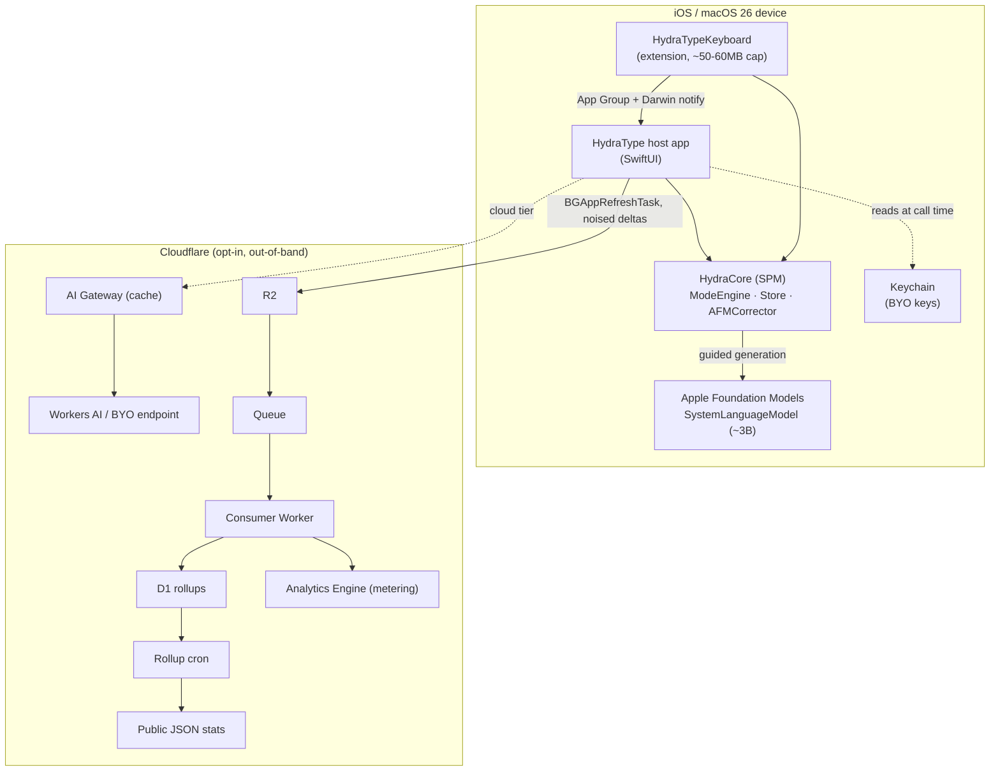
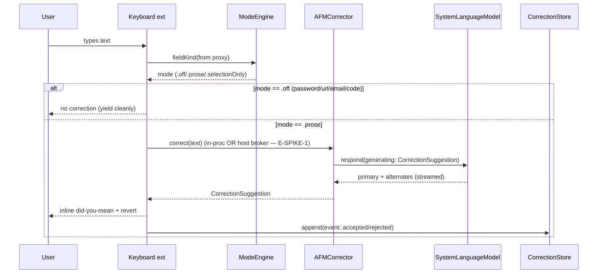
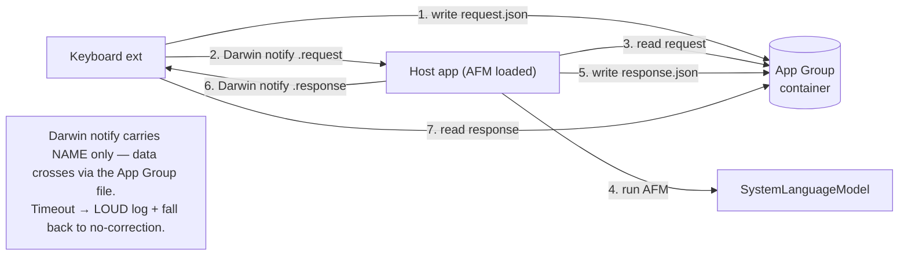
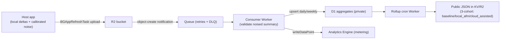
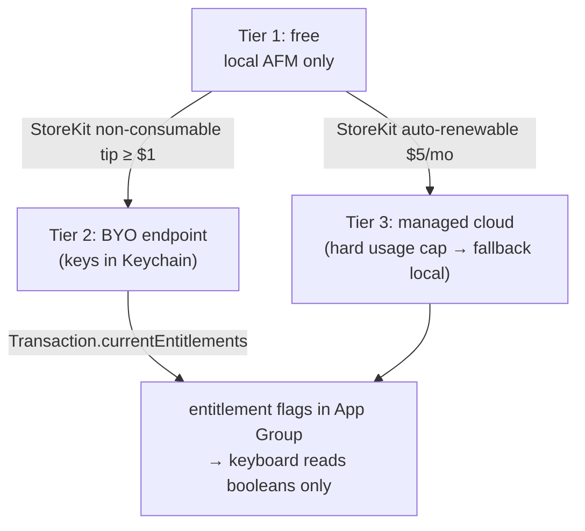
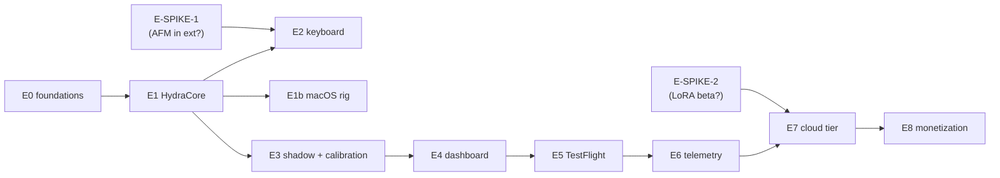

# hydratype — architecture graphs (quick reference)

Consolidated system graphs. Authoritative per-stack API surface lives in
[`docs/reference/`](reference/) (see [INDEX](reference/INDEX.md)); epics/slices in
[`docs/slices/`](slices/). Dated 2026-07-19.

## 1. System overview — three tiers, on-device first

## 2. Correction data flow (on-device)

## 3. Extension ↔ host broker (if E-SPIKE-1 = BROKER_REQUIRED)

## 4. Telemetry ingest (E6, opt-in + differentially noised)

## 5. Monetization / tiers (E8, host-app only per 4.4.1)

## 6. Epic dependency graph

