# Cloudflare Data Plane — Developer Reference (hydratype E6 telemetry)

**Date:** 2026-07-19
**Scope:** D1, R2, Queues, Analytics Engine, Workflows, and a consolidated `wrangler.jsonc`.
**Method:** Every claim traces to an official `developers.cloudflare.com` page (see [Sources](#sources)) or an explicitly-labelled `fedelm` cross-check. Anything not confirmed against an official page is flagged **LOUD**.

> **Metering decision carried over from the E-SPIKE-2 spike** (`spikes/workers-ai-lora/README.md`):
> per-request usage metering goes to **Analytics Engine**, NOT D1. D1 is a transactional SQLite store for
> lookups/application data; it is the wrong tool for high-cardinality, high-volume, append-only time-series
> metering. Keep D1 for authoritative low-cardinality rollups and lookups only.

---

## Ingest pipeline (E6)

```mermaid
flowchart LR
    A[Host app<br/>hydratype client] -->|PUT object| B[(R2 bucket<br/>telemetry-raw)]
    B -->|object-create<br/>event notification| Q[[Queue<br/>telemetry-events]]
    Q -->|batch delivery| C{{Consumer Worker<br/>queue&#40;batch,env&#41;}}
    C -->|prepare&#40;&#41;.bind&#40;&#41;.run&#40;&#41;<br/>low-cardinality rollup| D[(D1<br/>env.DB)]
    C -->|writeDataPoint&#40;&#41;<br/>fire-and-forget per-request metering| E[[Analytics Engine<br/>env.METRICS]]
    C -.->|retry&#40;&#41; on failure → DLQ<br/>never silent-drop| X[[DLQ<br/>telemetry-dlq]]
    D -->|SELECT rollups| F[Public JSON API<br/>Worker fetch handler]
    E -->|SQL API<br/>SUM&#40;_sample_interval&#41;| F
```



Confirmed path from the spike: **host app → R2 → `object-create` notification → Queue → consumer Worker**, which
does a D1 rollup **and** Analytics Engine metering, both surfaced by a public JSON endpoint.

---

## D1 — serverless SQLite (transactional / lookup)

**Binding** (`wrangler.jsonc`):
```jsonc
"d1_databases": [
  { "binding": "DB", "database_name": "hydratype-app", "database_id": "<uuid>" }
]
```

**Worker API** — prepared statements are the only supported query path:
```js
// SELECT — .all() returns { success, meta, results: [...] }
const { results } = await env.DB
  .prepare("SELECT * FROM sessions WHERE user_id = ?")
  .bind(userId)
  .all();

// Single row — .first() returns one object, a single column, or null
const row  = await env.DB.prepare("SELECT id FROM sessions WHERE k = ?").bind(k).first();
const just = await env.DB.prepare("SELECT id FROM sessions WHERE k = ?").bind(k).first("id");

// Write — .run() (alias of .all()); results is empty for INSERT/UPDATE/DELETE
const { success, meta } = await env.DB
  .prepare("INSERT INTO rollups (day, n) VALUES (?, ?)")
  .bind(day, n)
  .run();

// .raw() → arrays instead of objects; .raw({ columnNames: true }) prepends a header row
```

`meta` fields on a write/read: `served_by`, `duration`, `changes`, `last_row_id`, `changed_db`,
`size_after`, `rows_read`, `rows_written`.

**Binding notes:**
- `.bind()` uses positional `?` (or ordered `?NNN`) params and prevents SQL injection.
- `run()` **is an alias of `all()`** (official docs). `results` is empty for write ops.

**Transactions / batch:**
```js
await env.DB.batch([
  env.DB.prepare("UPDATE rollups SET n = n + 1 WHERE day = ?").bind(day),
  env.DB.prepare("INSERT INTO audit (day) VALUES (?)").bind(day),
]);
```
`db.batch([...])` runs as a **single implicit transaction, sequentially and atomically** — if any statement
fails the whole batch rolls back. D1 does **not** support interactive `BEGIN`/`COMMIT` in the Workers API
(`BEGIN TRANSACTION` errors). *(Source: `fedelm` cross-check, 6 sources, 2026-07-19 — corroborates the D1 docs' "batch = implicit transaction" wording. Verify against the live D1 reference before relying on rollback edge-cases.)*

**Migrations** (Wrangler):
```sh
wrangler d1 migrations create hydratype-app "add_rollups"   # writes migrations/NNNN_*.sql
wrangler d1 migrations list  hydratype-app --remote
wrangler d1 migrations apply hydratype-app --local          # dev
wrangler d1 migrations apply hydratype-app --remote         # production
```
Migration `.sql` files live in `migrations/` (override with `migrations_dir`); applied migrations are tracked
in the `d1_migrations` table (override with `migrations_table`).
**LOUD:** the fetched migrations page did not restate `--local` vs `--remote` explicitly — the `--remote` flag
targeting production D1 is standard Wrangler behaviour but confirm on your installed Wrangler version.

**Use D1 for / NOT for:**
- ✅ Low-cardinality rollups, session/config lookups, authoritative counters, transactional app data.
- ❌ Per-request metering, high-cardinality time-series, high write throughput → use **Analytics Engine**.

---

## R2 — object storage + event notifications → Queue

**Binding:**
```jsonc
"r2_buckets": [
  { "binding": "RAW", "bucket_name": "hydratype-telemetry-raw" }
]
```

**Object API (Worker):** `env.RAW.put(key, body)`, `.get(key)`, `.delete(key)`, `.head(key)`, `.list()`.

**Event notifications** — R2 emits notifications straight to a **Queue**:
- Event types: **`object-create`** (PutObject, CopyObject, CompleteMultipartUpload) and
  **`object-delete`** (DeleteObject, LifecycleDeletion).
- Enable with Wrangler (prereq: the queue and a consumer/HTTP-pull must already exist):
```sh
wrangler r2 bucket notification create hydratype-telemetry-raw \
  --event-type object-create \
  --queue telemetry-events
# optional: --prefix / --suffix filters. Up to 100 notification rules per bucket.
```
- **Message body** the consumer receives:
  `account`, `action` (e.g. `PutObject`), `bucket`, `object` (`{ key, size, eTag }`), `eventTime` (ISO),
  and `copySource` for CopyObject events. These arrive as normal Queue messages (`message.body`).

---

## Queues — producer / consumer, batches, retries, DLQ

**Bindings:**
```jsonc
"queues": {
  "producers": [ { "binding": "EVENTS", "queue": "telemetry-events" } ],
  "consumers": [
    {
      "queue": "telemetry-events",
      "max_batch_size": 100,
      "max_batch_timeout": 5,
      "max_retries": 3,
      "max_concurrency": 10,
      "dead_letter_queue": "telemetry-dlq"
    }
  ]
}
```

**Producer:**
```js
await env.EVENTS.send({ key, size });                 // single; ≤ 128 KB
await env.EVENTS.sendBatch(items.map(v => ({ body: v }))); // ≤ 100 msgs / ≤ 256 KB total
```

**Consumer handler:**
```js
export default {
  async queue(batch, env, ctx) {
    for (const message of batch.messages) {
      try {
        await handle(message.body, env);   // message: { id, timestamp, body, attempts }
        message.ack();                     // explicit success
      } catch (err) {
        message.retry({ delaySeconds: 30 }); // LOUD failure: requeue, never swallow
      }
    }
    // batch.ackAll() / batch.retryAll(options) also available
  }
};
```

**Batch semantics:** consumer receives a `MessageBatch` (`{ queue, messages[] }`); each `Message` has
`id`, `timestamp` (Date), `body`, `attempts` (starts at 1). A batch is delivered when `max_batch_size`
or `max_batch_timeout` (seconds) is hit.

**Retries / DLQ (no silent drop):** failed/`retry()`-ed messages are redelivered up to `max_retries`
(default **3**). After that, if `dead_letter_queue` is set they route there; **without a DLQ they are
deleted permanently.** DLQ messages with no active consumer are retained ~4 days. → Always configure a DLQ
**and** a consumer on it so failures are loud and inspectable, never dropped.

---

## Analytics Engine — the per-request metering surface

**Why AE, not D1:** AE is Cloudflare's documented, purpose-built path for high-cardinality, high-volume,
append-only usage metering. Writes are **fire-and-forget** (no `await` in the hot path), queried via
time-bucketed SQL. This is the E6/E7 metering surface.

**Binding:**
```jsonc
"analytics_engine_datasets": [
  { "binding": "METRICS", "dataset": "hydratype_usage" }
]
```

**Write (fire-and-forget — do not `await`):**
```js
env.METRICS.writeDataPoint({
  blobs:   ["gen", "us", modelId],  // string dimensions (group/filter)
  doubles: [tokensIn, tokensOut],   // numeric measures
  indexes: [customerId],            // sampling key — exactly ONE
});
// Docs: "You do not need to await writeDataPoint() — the runtime writes in the background."
```

**Limits to design around** (from the spike + AE limits docs):
- ≤ **250 data points per Worker invocation**; ≤ **20 blobs + 20 doubles + 1 index** per point.
- Blobs total ≤ **16 KB** per point; each index ≤ **96 bytes**. 90-day retention on the free tier.

**SQL API (query):**
```
POST https://api.cloudflare.com/client/v4/accounts/<account_id>/analytics_engine/sql
Authorization: Bearer <token>   # token needs "Account Analytics Read"
```
Columns: `index1`, `blob1..blob20`, `double1..double20`, `timestamp` (DateTime), `_sample_interval` (Int).
```sql
SELECT
  blob3            AS model_id,
  SUM(_sample_interval)            AS requests,      -- accurate count, NOT COUNT()
  SUM(double1 * _sample_interval)  AS tokens_in      -- sampling-weighted sum
FROM hydratype_usage
WHERE timestamp > NOW() - INTERVAL '1' DAY
GROUP BY model_id
```

**LOUD sampling caveat:** at high volume AE **samples** rows; every raw `COUNT()`/`SUM(col)` must be corrected
with `_sample_interval` (`SUM(_sample_interval)` for counts, `SUM(col * _sample_interval)` for weighted sums).
If exact counts are ever **billing/legally binding**, keep a small authoritative D1 or Durable Object counter
as the ledger and use AE for analytics — but AE remains the primary metering surface.

---

## Workflows — durable multi-step execution (E7 LoRA-retrain job)

**Binding:**
```jsonc
"workflows": [
  { "name": "lora-retrain", "binding": "RETRAIN", "class_name": "LoraRetrainWorkflow" }
]
```

**Definition:**
```ts
import { WorkflowEntrypoint, WorkflowEvent, WorkflowStep, NonRetryableError } from "cloudflare:workers";

export class LoraRetrainWorkflow extends WorkflowEntrypoint<Env, Params> {
  async run(event: WorkflowEvent<Params>, step: WorkflowStep) {
    const dataset = await step.do("collect-dataset", {
      retries: { limit: 3, delay: "30 seconds", backoff: "exponential" },
      timeout: "5 minutes",
    }, async () => {
      return await collect(event.payload);   // return value is durably persisted
    });

    await step.sleep("cool-off", "1 hour");
    // await step.sleepUntil("resume", new Date("2026-08-01"));

    await step.do("train-adapter", async () => {
      if (fatal) throw new NonRetryableError("bad input"); // stops retries immediately
      return await train(dataset);
    });
  }
}
```

**Trigger an instance:**
```ts
const instance = await env.RETRAIN.create({ id: "run-123", params: { hello: "world" } });
```

**Durability model:** each `step.do()` is independently retried per its `WorkflowStepConfig`
(`retries: { limit, delay, backoff: "linear" | "exponential" }`, optional `timeout`); completed steps'
return values are memoized so a workflow resumes without re-running finished work. `step.sleep`/`sleepUntil`
suspend without consuming compute. `NonRetryableError` short-circuits retries for fatal conditions.

**Why Workflows for E7:** the LoRA-retrain job is long-running and multi-stage (collect → train → publish
adapter → flip pointer); Workflows give durable execution, per-step retry/backoff, and resumability that a
single Worker invocation (CPU/wall-time bounded) cannot.

---

## Consolidated `wrangler.jsonc` (one Worker, all bindings)

```jsonc
{
  "name": "hydratype-telemetry",
  "main": "src/index.ts",
  "compatibility_date": "2026-07-19",
  "observability": { "enabled": true },

  // D1 — transactional rollups + lookups
  "d1_databases": [
    { "binding": "DB", "database_name": "hydratype-app", "database_id": "<uuid>" }
  ],

  // R2 — raw telemetry object store (object-create notifications wired via CLI, see below)
  "r2_buckets": [
    { "binding": "RAW", "bucket_name": "hydratype-telemetry-raw" }
  ],

  // Queues — producer + consumer of R2 object-create events, with DLQ
  "queues": {
    "producers": [
      { "binding": "EVENTS", "queue": "telemetry-events" }
    ],
    "consumers": [
      {
        "queue": "telemetry-events",
        "max_batch_size": 100,
        "max_batch_timeout": 5,
        "max_retries": 3,
        "max_concurrency": 10,
        "dead_letter_queue": "telemetry-dlq"
      }
    ]
  },

  // Analytics Engine — per-request metering surface
  "analytics_engine_datasets": [
    { "binding": "METRICS", "dataset": "hydratype_usage" }
  ],

  // Workflows — durable E7 LoRA-retrain job
  "workflows": [
    { "name": "lora-retrain", "binding": "RETRAIN", "class_name": "LoraRetrainWorkflow" }
  ]
}
```

R2 → Queue notifications are **not** declared in `wrangler.jsonc`; wire them with the CLI after deploy:
```sh
wrangler r2 bucket notification create hydratype-telemetry-raw \
  --event-type object-create --queue telemetry-events
```

**LOUD:** exact `queues.consumers[]` field names/defaults and the `workflows[]` block shape can drift between
Wrangler releases (the Workflows page still shows the older `wrangler.toml` `[[workflows]]` form). Validate the
consolidated config against your installed Wrangler with `wrangler deploy --dry-run` before shipping.

---

## Cheat-sheet

| Service | Binding key | Hot API | Use for | Avoid for |
|---|---|---|---|---|
| **D1** | `d1_databases` | `env.DB.prepare().bind().run()/all()/first()`; `batch([...])` atomic | rollups, lookups, authoritative counters | high-cardinality per-request metering |
| **R2** | `r2_buckets` | `env.RAW.put/get/delete`; `object-create` → Queue | raw payload storage, event source | querying/aggregation |
| **Queues** | `queues.producers/consumers` | `send()/sendBatch()`; `queue(batch,env,ctx)`; `ack()/retry()` | decoupled ingest, retries, DLQ | request/response latency-critical paths |
| **Analytics Engine** | `analytics_engine_datasets` | `writeDataPoint({blobs,doubles,indexes})` (no await); SQL API | per-request metering, usage analytics | exact billing counts w/o `_sample_interval` correction |
| **Workflows** | `workflows` | `WorkflowEntrypoint.run(event, step)`; `step.do/sleep`; `create()` | durable multi-step jobs (E7 retrain) | simple single-shot request handling |

---

## Sources

D1:
- https://developers.cloudflare.com/d1/worker-api/prepared-statements/
- https://developers.cloudflare.com/d1/reference/migrations/
- `fedelm` cross-check (D1 `batch()` = implicit atomic transaction; no interactive BEGIN/COMMIT), 2026-07-19

R2:
- https://developers.cloudflare.com/r2/buckets/event-notifications/

Queues:
- https://developers.cloudflare.com/queues/configuration/javascript-apis/
- https://developers.cloudflare.com/queues/configuration/dead-letter-queues/

Analytics Engine:
- https://developers.cloudflare.com/analytics/analytics-engine/get-started/
- https://developers.cloudflare.com/analytics/analytics-engine/sql-api/
- https://developers.cloudflare.com/analytics/analytics-engine/limits/ (via E-SPIKE-2 spike)

Workflows:
- https://developers.cloudflare.com/workflows/build/workers-api/

Prior hydratype spike (metering decision):
- `spikes/workers-ai-lora/README.md` (E-SPIKE-2, 2026-07-19)
</content>
</invoke>
