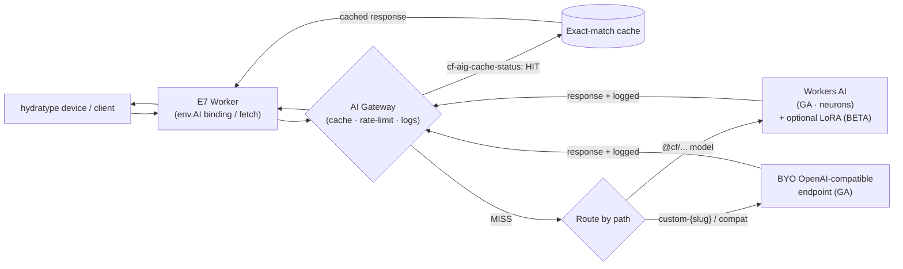

# Cloudflare Workers AI + AI Gateway — Developer Reference (E7 backend)

Date: 2026-07-19
Scope: Workers AI `AI` binding, text-generation catalog + neuron pricing, BYO-LoRA
serving (BETA), AI Gateway (caching / rate-limiting / logging), and the BYO-endpoint
(OpenAI-compatible) GA path. Every claim traces to a URL in [Sources](#sources).

> Commodity-Intelligence axiom: model ids below are **versioned and change**. Never
> hardcode a model id or the adapter-capable list into E7 — read them from the live
> models catalog (or a config surface) at build/run time. Ids here are illustrative.

---

## 0. Status at a glance (BETA vs GA)

| Capability | Status (2026-07-19) | Notes |
|---|---|---|
| Workers AI (inference, `env.AI.run`) | **GA** | Billed via neurons even in `wrangler dev`. |
| Workers AI neuron pricing / free tier | **GA** | $0.011 / 1,000 neurons; 10,000 neurons/day free. |
| AI Gateway (analytics, caching, rate-limiting, logging) | **GA** | Applies to Workers AI and any provider. |
| Exact-match caching + `cf-aig-cache-status` header | **GA** | HIT/MISS; per-gateway + per-request override. |
| AI Gateway rate limiting | **GA** | Fixed / sliding window; 429 on exceed. |
| **BYO-LoRA / fine-tune adapter serving** | **OPEN BETA — NOT GA** | "in open beta and free during this period." Reconfirmed 2026-07-19; unchanged since the prior spike. |
| BYO-endpoint / OpenAI-compatible routing | **GA** | The non-beta-dependent E7 path. |
| Deprecated: `/compat/chat/completions` unified endpoint | **DEPRECATED** | Use the REST API OpenAI-compatible endpoint instead (see §5). Existing integrations keep working. |

**LoRA verdict: still OPEN BETA, not GA.** Cloudflare's own LoRA docs page still reads
"in open beta and free during this period." Build E7's primary inference on the GA
BYO-endpoint path; treat any Workers-AI-LoRA lane as an experimental, flag-gated option.

---

## 1. Workers AI — the `AI` binding

### wrangler.jsonc
```jsonc
{
  "name": "hydratype-e7",
  "main": "src/index.ts",
  "compatibility_date": "2026-07-19",
  "ai": {
    "binding": "AI"
  }
}
```
TOML equivalent:
```toml
[ai]
binding = "AI"
```

### Typing + invocation
```ts
export interface Env {
  AI: Ai;
}

// Basic text generation. Model id is illustrative — do NOT hardcode; resolve from config.
const response = await env.AI.run("@cf/meta/llama-3.1-8b-instruct", {
  prompt: "Your question here",
});
```

- The binding surfaces as `env.AI`; the primary method is `env.AI.run(model, input)`.
- **Cost caveat:** "Using Workers AI always accesses your Cloudflare account in order to
  run AI models and will incur usage charges even in local development" — i.e.
  `wrangler dev` generates billable neuron usage.

### Text-generation catalog (illustrative, versioned)
Resolve the live list from the models catalog filtered to text-generation. Ids seen in
current docs/changelog include (do NOT pin these):
`@cf/meta/llama-3.1-8b-instruct`, `@cf/meta/llama-3.3-70b-instruct-fp8-fast`,
`@cf/meta/llama-3.2-11b-vision-instruct`, `@cf/qwen/qwen2.5-coder-32b-instruct`,
`@cf/qwen/qwq-32b`, `@cf/mistralai/mistral-small-3.1-24b-instruct`,
`@cf/google/gemma-3-12b-it`, `@cf/deepseek-ai/deepseek-r1-distill-qwen-32b`.

### Pricing / neuron model (GA)
- **Neurons** measure AI output across models = the GPU compute for a request.
- **$0.011 per 1,000 neurons.**
- **Free allocation: 10,000 neurons/day**, no charge; resets daily at 00:00 UTC.
- Workers Paid plan is charged standard rate for consumption beyond the free allowance.

---

## 2. BYO-LoRA adapters / fine-tunes — **OPEN BETA**

> LOUD CAVEAT: This entire section is beta-gated. It is "in open beta and free during
> this period" — shape, limits, model list, and pricing can change without notice. Do
> not make it E7's sole inference path.

### How BYO-LoRA serving works
Upload a trained adapter to your account, then reference it at inference time on a
compatible base model. Adapters are applied at request time on top of the base model.

### Adapter-capable base models (versioned — reconfirm against the live models page)
The LoRA docs point to the models page filtered by LoRA capability rather than an
exhaustive inline list. Examples currently associated with LoRA support include
Mistral 7B Instruct v0.2, Llama 2 7B Chat HF, and Gemma models; the changelog also
lists newer bases (e.g. `@cf/qwen/qwen2.5-coder-32b-instruct`, `@cf/qwen/qwq-32b`,
`@cf/meta/llama-guard-3-8b`) with more "coming soon." **This is the single least-stable
fact here — read it live, never hardcode.**

### Adapter constraints
- Adapter rank `r <= 8` (larger ranks up to 32 also referenced) — check live docs.
- Adapter files must be **under 300 MB**.
- File names must be exactly `adapter_config.json` and `adapter_model.safetensors`.
- Up to **100 LoRA adapters per account** (test limit).

### Upload flow
Via Wrangler:
```bash
npx wrangler ai finetune create <model_name> <finetune_name> <folder_path>
```
Via REST API: create the finetune record first, then upload each file separately to the
finetune-assets endpoint using multipart form data.

### Inference with an adapter
```ts
const out = await env.AI.run("@cf/mistral/mistral-7b-instruct-v0.2-lora", {
  messages: [{ role: "user", content: "..." }],
  raw: true,               // skip default chat templating
  lora: "finetune_id_or_name",
});
```
- Pass `lora: "<finetune_id_or_name>"` plus `raw: true` to bypass default templating.

---

## 3. AI Gateway in front of Workers AI

Put a gateway in front of inference to get caching, rate-limiting, analytics, and logging.
For Workers AI via the binding, pass a `gateway` object as the third arg to `env.AI.run`:

```ts
const response = await env.AI.run(
  "@cf/meta/llama-3.1-8b-instruct",
  { prompt: "Why use Cloudflare for AI inference?" },
  {
    gateway: {
      id: "{gateway_id}",   // existing gateway, same account as the Worker
      skipCache: false,     // bypass cache when true
      cacheTtl: 3360,       // per-request TTL (seconds)
    },
  },
);
```
`id` (string, required), `skipCache` (boolean, default false), `cacheTtl` (number).

### Getting a gateway URL from the binding (for SDKs / BYO providers)
```ts
const baseUrl  = await env.AI.gateway("my-gateway").getUrl();          // .../v1/{acct}/my-gateway/
const openaiUrl = await env.AI.gateway("my-gateway").getUrl("openai"); // provider-specific
```

---

## 4. AI Gateway — caching (GA)

### Exact-match caching
Cache key = SHA-256 hash of: Provider + Endpoint (API path) + Model + Provider auth header
(e.g. the `Authorization` bearer token) + full request body. **Any** variation → a
separate cache entry (exact match only).

### Cache-status response header
```
cf-aig-cache-status: HIT | MISS
```
`HIT` = served from cache storage; `MISS` = fetched from origin/provider.

### Config levels + per-request headers
- **Per-gateway default:** Dashboard → AI → AI Gateway → Settings → Cache Responses
  (or API `cache_ttl`). Applies uniformly unless overridden.
- **Per-request overrides (HTTP headers):**
  - `cf-aig-cache-ttl: <seconds>` — cache duration; **min 60 s, max 1 month**.
  - `cf-aig-cache-key: <key>` — custom cache key overriding the default composition.
  - `cf-aig-skip-cache` — bypass cache, fetch directly from provider.
- **Default when caching enabled but no explicit TTL:** dashboard settings apply; if
  caching is not enabled on the gateway, responses are cached **5 minutes** by default
  when a custom cache key is used.
- Via the binding, the same controls are `skipCache` and `cacheTtl` on the `gateway` object.

---

## 5. AI Gateway — rate limiting, logging

### Rate limiting (GA)
- Controls traffic reaching your app to prevent runaway bills / abuse.
- Exceeding the limit → **`429 Too Many Requests`**.
- Configured per gateway (Dashboard → Settings → Rate-limiting, or API params
  `rate_limiting_interval`, `rate_limiting_limit`, `rate_limiting_technique`). Applied
  uniformly to all requests for that gateway.
- **Fixed window:** no more than `x` requests in a set N-minute window.
- **Sliding window:** no more than `x` requests in the last N minutes (continuous).

### Logging / analytics
Routing any request through the gateway records analytics (request/response, tokens,
cache hits, costs) and logs, viewable per gateway. Metering for E7 billing is still best
done in Workers Analytics Engine (see the E-SPIKE-2 decision), with gateway logs as a
cross-check.

---

## 6. BYO-endpoint (OpenAI-compatible) — the GA, non-beta path

This is the recommended E7 primary path: it does not depend on the Workers AI LoRA open
beta. Front any OpenAI-compatible or custom/self-hosted inference endpoint with AI Gateway.

### Universal / gateway URL shape
```
https://gateway.ai.cloudflare.com/v1/{account_id}/{gateway_id}/...
```

### OpenAI-compatible (unified) endpoint
> Deprecation: the `/compat/chat/completions` unified endpoint is **deprecated**. Prefer
> the REST API OpenAI-compatible endpoint:
> `https://api.cloudflare.com/client/v4/accounts/{account_id}/ai/v1/chat/completions`.
> The `/compat` path continues to work for existing integrations. (See AXIOM/task note below.)

```js
import OpenAI from "openai";
const client = new OpenAI({
  apiKey: "YOUR_PROVIDER_API_KEY",
  baseURL: "https://gateway.ai.cloudflare.com/v1/{account_id}/{gateway_id}/compat",
});
const response = await client.chat.completions.create({
  model: "google-ai-studio/gemini-2.0-flash", // {provider}/{model}
  messages: [{ role: "user", content: "What is Cloudflare?" }],
});
```
Switch providers by changing `model` (`{provider}/{model}`) and `apiKey`. Combine with the
Universal Endpoint to add cross-provider fallbacks with a standardized response format.

### Custom / self-hosted provider (full BYO)
Register a custom provider (a `slug` + `base_url`) and call it through the gateway:
```
# Unified API (provider is OpenAI-compatible): model = custom-{slug}/{model-name}
curl https://gateway.ai.cloudflare.com/v1/{account_id}/{gateway_id}/compat/chat/completions \
  -H "Authorization: Bearer $PROVIDER_API_KEY" \
  -H "cf-aig-authorization: Bearer $CF_AIG_TOKEN" \
  -d '{"model":"custom-my-llm/my-model","messages":[{"role":"user","content":"hi"}]}'

# Provider-specific endpoint (any native API shape): /custom-{slug}/{path}
curl https://gateway.ai.cloudflare.com/v1/{account_id}/{gateway_id}/custom-internal-llm/serving/models/my-model:predict \
  -H "Authorization: Bearer $INTERNAL_API_KEY" \
  -H "Content-Type: application/json" \
  -d '{"instances":[{"prompt":"Summarize the following text:"}]}'
```
- **Unified API** (`/compat`): use when the custom provider speaks the OpenAI
  `/chat/completions` schema; specify provider via `model: custom-{slug}/{model-name}`.
- **Provider-specific endpoint**: use for non-standard API paths/bodies; full control over
  the upstream path via `/custom-{slug}/{path}`. `base_url` holds only the domain (or a
  fixed shared prefix); the path after the slug is appended to the upstream.
- `cf-aig-authorization: Bearer {token}` authenticates to the gateway itself
  (separate from the upstream provider's `Authorization`).

---

## 7. Request path (device → gateway → inference)



---

## Sources

Workers AI binding / usage / pricing:
- https://developers.cloudflare.com/workers-ai/get-started/workers-wrangler/
- https://developers.cloudflare.com/workers-ai/platform/pricing/
- https://developers.cloudflare.com/workers-ai/changelog/
- https://developers.cloudflare.com/changelog/post/2025-04-11-new-models-faster-inference/

LoRA / fine-tunes (OPEN BETA):
- https://developers.cloudflare.com/workers-ai/features/fine-tunes/loras/
- https://developers.cloudflare.com/workers-ai/features/fine-tunes/public-loras/
- https://blog.cloudflare.com/workers-ai-ga-huggingface-loras-python-support/
- https://blog.cloudflare.com/fine-tuned-inference-with-loras/

AI Gateway (caching / rate-limiting / binding / BYO):
- https://developers.cloudflare.com/ai-gateway/features/caching/
- https://developers.cloudflare.com/ai-gateway/features/rate-limiting/
- https://developers.cloudflare.com/ai-gateway/usage/providers/workersai/
- https://developers.cloudflare.com/ai-gateway/usage/worker-binding-methods/
- https://developers.cloudflare.com/ai-gateway/configuration/custom-providers/
- https://developers.cloudflare.com/ai-gateway/usage/chat-completion/
- https://developers.cloudflare.com/ai-gateway/usage/universal/
- https://developers.cloudflare.com/changelog/post/2025-06-03-aig-openai-compatible-endpoint/

Prior internal spike (E-SPIKE-2): spikes/workers-ai-lora/README.md

---

### AXIOM CHECK / deprecation note
The AI Gateway `/compat/chat/completions` (Unified API) endpoint is **deprecated** in
favor of the REST API OpenAI-compatible endpoint at
`api.cloudflare.com/client/v4/accounts/{account_id}/ai/v1/chat/completions`. Per the
standing deprecation-never-cycled rule, E7 should target the REST API endpoint for any
new BYO-endpoint wiring and a migration task should be filed in the project task store
(this doc is reference-only and does not itself perform the migration).
