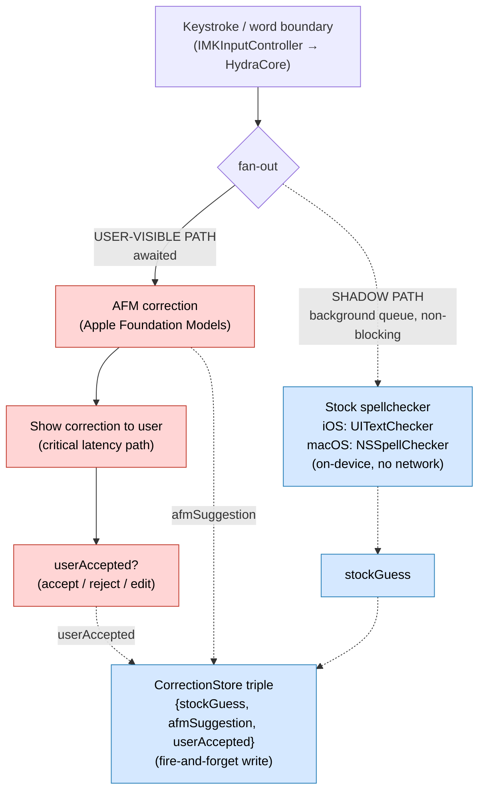

# macOS InputMethodKit (IMKit) + UITextChecker / NSSpellChecker — Developer Reference

**For:** hydratype E1b (macOS test rig — "dumbest possible layer" IME shell, thread T34) and E3 (shadow comparison).
**Date:** 2026-07-19
**Status:** Authoritative cheat-sheet compiled from official Apple docs + fedelm web research. Apple's own InputMethodKit reference is famously thin (many symbols are undocumented header-only), so items that could NOT be confirmed against `developer.apple.com` are flagged **[UNCONFIRMED]** and should be verified against the framework headers before shipping.

---

## 1. InputMethodKit (macOS) — the pass-through IME shell

InputMethodKit is macOS-only (AppKit world). It lets you ship a standalone input method **bundle** — no App Store, no notarized-app-store path required. The bundle is installed to `/Library/Input Methods` (system-wide) or `~/Library/Input Methods` (per-user), then enabled in *System Settings → Keyboard → Input Sources*.

> For hydratype this is the T34 "dumbest possible layer": an `IMKInputController` subclass that captures keystrokes and forwards them to HydraCore, holding **zero** correction logic itself.

### 1.1 Core classes

| Class | Role | Key surface |
|---|---|---|
| `IMKServer` | Runs the input method process; owns the Mach connection; instantiates one `IMKInputController` per client text field. | `init(name:bundleIdentifier:)` |
| `IMKInputController` | Per-client controller — your subclass. Receives key events, manages marked/committed text. | `inputText(_:client:)`, `handle(_:client:)`, `commitComposition(_:)`, `activateServer(_:)`, `deactivateServer(_:)` |
| `IMKCandidates` | Optional candidates/suggestion window widget. | `init(server:panelType:)`, `update()`, `show(_:)`, `hide()` |
| `IMKInputServerProtocol` / `IMKServerInput` (informal protocols) | Declare the event-handling entry points the controller may implement. | `inputText:client:`, `inputText:key:modifiers:client:`, `didCommandBySelector:client:` |

Sources: [A1] developer.apple.com/documentation/inputmethodkit · [A2] .../imkserver · [A3] .../imkinputcontroller · [A4] .../imkcandidates

### 1.2 `main.swift` — bootstrapping `IMKServer`

```swift
import InputMethodKit

// The connection name MUST match Info.plist's InputMethodConnectionName.
let kConnectionName = Bundle.main.infoDictionary!["InputMethodConnectionName"] as! String

let server = IMKServer(
    name: kConnectionName,
    bundleIdentifier: Bundle.main.bundleIdentifier   // must contain ".inputmethod."
)

// Load the candidates menu/UI if you ship one, then run the loop.
NSApplication.shared.run()   // background-only app; no main window
```

### 1.3 `IMKInputController` subclass — forward keystrokes to HydraCore

The controller is where the OS hands you input. There are two common event entry points; implement the one matching your `Info.plist` `InputMethodServerControllerClass` contract:

```swift
import InputMethodKit

@objc(HydraInputController)          // @objc name referenced by Info.plist
final class HydraInputController: IMKInputController {

    // Simplest hook: text already resolved to a string.
    override func inputText(_ string: String!, client sender: Any!) -> Bool {
        // T34: do NOT correct here. Forward raw keystroke to HydraCore.
        HydraCore.shared.ingest(keystroke: string, client: sender)
        return false   // false = let the client insert normally; true = we consumed it
    }

    // Richer hook: full NSEvent (keyCode + modifiers). Prefer this for a real IME.
    override func handle(_ event: NSEvent!, client sender: Any!) -> Bool {
        guard event.type == .keyDown else { return false }
        return HydraCore.shared.handleKeyDown(event, client: sender)
    }

    override func activateServer(_ sender: Any!) {
        // Client field gained focus — reset per-field state.
    }
    override func deactivateServer(_ sender: Any!) {
        commitComposition(sender)
    }

    // Show/replace text in the client via IMKTextInput (the `sender`):
    func replace(_ text: String, in sender: Any) {
        (sender as? IMKTextInput)?.insertText(text,
            replacementRange: NSRange(location: NSNotFound, length: 0))
    }
}
```

**Event routing note:** returning `false` from `inputText(_:client:)`/`handle(_:client:)` tells the system you did NOT consume the event (client inserts the character itself); returning `true` means you handled it (you are responsible for inserting via `IMKTextInput`). For the pure shadow/forwarding rig, returning `false` keeps normal typing intact while still letting HydraCore observe every keystroke.

### 1.4 Candidates window (`IMKCandidates`)

```swift
let candidates = IMKCandidates(server: server, panelType: kIMKSingleColumnScrollingCandidatePanel)
// Provide candidates by overriding on the controller:
override func candidates(_ sender: Any!) -> [Any]! { HydraCore.shared.currentCandidates() }
override func candidateSelected(_ candidateString: NSAttributedString!) { /* commit choice */ }
candidates.update()
candidates.show(kIMKLocateCandidatesBelowHint)
```

> **[UNCONFIRMED / advisory]** `IMKCandidates` is widely reported (2026 IME dev guidance, [W1]) as buggy/legacy; many production IMEs render their own NSPanel instead. Apple still documents it [A4] but treats it as optional. For E1b the candidates window is not on the critical path — skip it unless a test needs it.

### 1.5 Registering the input method — `Info.plist` keys (no App Store)

Installation = drop the `.app` bundle into `~/Library/Input Methods` and log out/in (or add via System Settings). No App Store, no paid Developer Program required for local dev; **code-signing** is needed for distribution and increasingly for Gatekeeper on other machines.

Required / conventional keys (verify against a working sample [W2] before shipping):

| Key | Value |
|---|---|
| `InputMethodConnectionName` | `$(PRODUCT_BUNDLE_IDENTIFIER)_Connection` (must equal the name passed to `IMKServer`) |
| `InputMethodServerControllerClass` | `HydraInputController` (your `@objc` class) |
| `InputMethodServerDelegateClass` | `HydraInputController` (often the same class) |
| `NSPrincipalClass` | `NSApplication` (or a custom `NSManualApplication` subclass — common in samples) |
| `LSBackgroundOnly` / "Application is background only" | `YES` (or `LSUIElement = YES`) |
| `tsInputMethodCharacterRepertoireKey` | array of script/language tags, e.g. `["Latn"]` |
| `tsInputMethodIconFileKey` | menu-bar icon file (optional) |
| **Bundle identifier** | MUST contain `.inputmethod.` (e.g. `com.hydratype.inputmethod.HydraIME`) |

**Sandboxing:** if sandboxed, add a `com.apple.security.temporary-exception.mach-register.global-name` entitlement carrying the connection name so the Mach service can register [W1][W2]. **[UNCONFIRMED]** exact entitlement necessity varies by macOS version — confirm on your target OS.

**Swift 6 concurrency [UNCONFIRMED / advisory]:** community guidance ([W1]) reports the whole IME target generally needs `@MainActor` because IMKit callbacks arrive on the main thread and are not `Sendable`.

---

## 2. Spell-checking: UITextChecker (iOS) vs NSSpellChecker (macOS)

E3's "shadow challenger" runs the **stock OS spellchecker** silently next to Apple Foundation Models (AFM) suggestions, logging `{stockGuess, afmSuggestion, userAccepted}`. Both stock checkers are **fully on-device / no network** — safe to run silently.

> **Platform split — call this out loudly:**
> - **`UITextChecker` is UIKit → iOS / iPadOS / Mac Catalyst only.** It does **not** exist in plain AppKit macOS.
> - **On the native macOS rig (E1b), use `NSSpellChecker` (AppKit).** Same capability, different API shape.
> - Both are offline (local dictionaries). Do not assume UITextChecker code compiles on the mac IME target.

Sources: [A5] developer.apple.com/documentation/uikit/uitextchecker · [A6] .../appkit/nsspellchecker · [W3] nshipster.com/uitextchecker

### 2.1 `UITextChecker` (iOS) — the shadow challenger

```swift
import UIKit

let checker = UITextChecker()
let text = "I hav a speling mistak"
let nsText = text as NSString
let full = NSRange(location: 0, length: nsText.length)

// 1. Find the first misspelled word range.
let miss = checker.rangeOfMisspelledWord(
    in: text, range: full, startingAt: 0, wrap: false, language: "en_US")

if miss.location != NSNotFound {
    // 2. Correction candidates for that range.
    let stockGuesses = checker.guesses(forWordRange: miss, in: text, language: "en_US") ?? []
    // 3. (Autocomplete use) completions for a partial word.
    let completions = checker.completions(forPartialWordRange: miss, in: text, language: "en_US") ?? []
    // stockGuesses[0] is the shadow challenger's top pick -> log it.
}

// Session/dictionary controls (do NOT call in shadow mode — must stay side-effect free):
// checker.ignoreWord(_:) / UITextChecker.learnWord(_:) / hasLearnedWord(_:) / unlearnWord(_:)
```

Signatures ([A5]):
- `rangeOfMisspelledWord(in: String, range: NSRange, startingAt: Int, wrap: Bool, language: String) -> NSRange` — returns `{NSNotFound, 0}` when nothing misspelled.
- `guesses(forWordRange: NSRange, in: String, language: String) -> [String]?`
- `completions(forPartialWordRange: NSRange, in: String, language: String) -> [String]?`
- Class method `UITextChecker.availableLanguages -> [String]`.

**Ordering caveat [W3]:** `completions(...)` is documented as probability-ordered but is widely observed to return **alphabetical** order on iOS; `guesses(...)` is best-first. Do not rely on completion ordering as a quality signal in E3.

### 2.2 `NSSpellChecker` (macOS) — mac-rig equivalent

```swift
import AppKit

let sc = NSSpellChecker.shared
let text = "I hav a speling mistak"

// 1. Find misspelled range (no wrap/language-array variant shown for brevity).
let miss = sc.checkSpelling(of: text, startingAt: 0)   // -> NSRange

if miss.location != NSNotFound {
    // 2. Correction candidates.
    let stockGuesses = sc.guesses(forWordRange: miss, in: text,
                                  language: "en", inSpellDocumentWithTag: 0) ?? []
    // stockGuesses[0] -> log as stockGuess for the E3 triple.
}
```

Equivalent surface ([A6][W4]):
- `checkSpelling(of: String, startingAt: Int) -> NSRange` (and the fuller `checkSpelling(of:startingAt:language:wrap:inSpellDocumentWithTag:wordCount:)`).
- `guesses(forWordRange: NSRange, in: String, language: String, inSpellDocumentWithTag: Int) -> [String]?`
- `completions(forPartialWordRange:in:language:inSpellDocumentWithTag:) -> [String]?`
- `NSSpellChecker.shared` is the singleton; also offers grammar checking and `NSTextCheckingResult`-based `check(_:...)`.

**Mapping table (E3 abstraction — write one `StockSpellChecker` protocol, two impls):**

| Concept | UITextChecker (iOS) | NSSpellChecker (macOS) |
|---|---|---|
| instance | `UITextChecker()` (per-use) | `NSSpellChecker.shared` (singleton) |
| find misspelling | `rangeOfMisspelledWord(in:range:startingAt:wrap:language:)` | `checkSpelling(of:startingAt:)` |
| correction guesses | `guesses(forWordRange:in:language:)` | `guesses(forWordRange:in:language:inSpellDocumentWithTag:)` |
| completions | `completions(forPartialWordRange:in:language:)` | `completions(forPartialWordRange:in:language:inSpellDocumentWithTag:)` |
| learn/ignore | `learnWord`/`ignoreWord` | `learnWord(_:)`/`ignoreWord(_:inSpellDocumentWithTag:)` |
| network | none (on-device) | none (on-device) |

---

## 3. Keeping the shadow comparison OFF the latency path

E3's non-negotiable: **the stock checker must never block the user-visible correction.** The AFM suggestion is shown as soon as it is ready; the UITextChecker/NSSpellChecker run and the `CorrectionStore` write happen asynchronously and are allowed to lose the race with zero user impact.

Design rules:
1. **Show first, log later.** The shown-correction path awaits *only* AFM. The stock-checker call is dispatched to a background queue and its result is joined with `afmSuggestion` only for logging.
2. **Fire-and-forget the triple.** `{stockGuess, afmSuggestion, userAccepted}` is written to `CorrectionStore` off the main thread; a dropped/late stock result logs `stockGuess = nil` rather than delaying anything.
3. **No shared mutable dictionary side-effects.** In shadow mode do NOT call `learnWord`/`ignoreWord` — keep the challenger stateless so it cannot perturb the user's real spelling experience.
4. **Bounded work.** Cap the stock call (e.g. time-box / cancel if AFM already committed and the user moved on) so background work cannot pile up under fast typing.



Legend: **red** = user-visible latency path (awaited); **blue** = shadow/logging path (background, allowed to lose the race). Solid arrows are awaited; dotted arrows are async/best-effort.

---

## Sources

Official Apple documentation (primary):
- [A1] InputMethodKit framework — https://developer.apple.com/documentation/inputmethodkit
- [A2] IMKServer — https://developer.apple.com/documentation/inputmethodkit/imkserver
- [A3] IMKInputController — https://developer.apple.com/documentation/inputmethodkit/imkinputcontroller
- [A4] IMKCandidates — https://developer.apple.com/documentation/inputmethodkit/imkcandidates
- [A5] UITextChecker (UIKit) — https://developer.apple.com/documentation/uikit/uitextchecker
- [A6] NSSpellChecker (AppKit) — https://developer.apple.com/documentation/appkit/nsspellchecker

Secondary / community (used where Apple docs are thin — flagged inline):
- [W1] macOS Input Method Development Guidelines 2026 (Shiki Suen) — https://shikisuen.medium.com/macos-input-method-development-guidelines-for-2026-5123461fa53b
- [W2] macOS IMKit sample (ensan-hcl) — https://github.com/ensan-hcl/macOS_IMKitSample_2021
- [W3] NSHipster — UITextChecker — https://nshipster.com/uitextchecker/
- [W4] NSSpellChecker / UITextChecker difference — https://stackoverflow.com/questions/21411372/difference-between-nsspellchecker-and-uitextchecker

**LOUD caveats:** Apple's InputMethodKit reference pages are sparse; several method names, the `IMKServerInput` informal-protocol entry points, exact `Info.plist` key set, and sandbox entitlement requirements above are corroborated from working sample projects [W2] and 2026 community guidance [W1], NOT from a complete Apple spec — verify against the framework headers (`InputMethodKit.framework/Headers/`) and a build on your target macOS before relying on them. Items marked **[UNCONFIRMED]** are the highest-risk.
