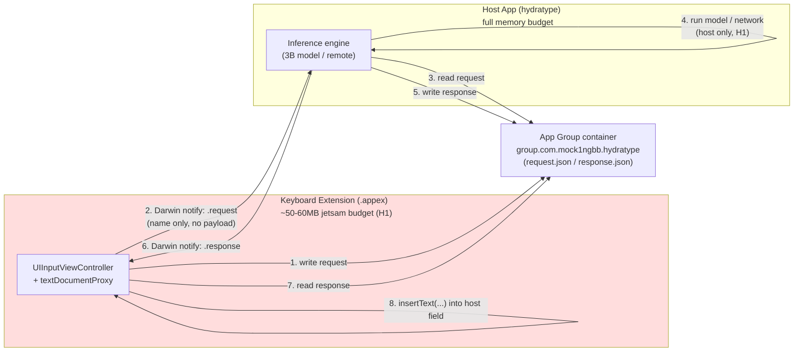

# iOS Custom Keyboard Extensions + App Groups + IPC — Developer Reference

**Project:** hydratype · **Date:** 2026-07-19 · **App Group:** `group.com.mock1ngbb.hydratype`

Authoritative reference assembled from official Apple sources (see [Sources](#sources)).
Every constraint below is tied to a hydratype hardening item (H1 = memory/model-offload,
H2 = secure-field / autofill boundary) in the [Hardening Map](#hydratype-hardening-map).

> **LOUD — confirmed vs unconfirmed.** Apple's *published* documentation does **NOT**
> state an exact numeric memory ceiling for keyboard extensions — it only says the budget
> is "significantly lower" than a foreground app and varies by extension type and device.
> The commonly cited **~50–60 MB (some report up to ~77 MB total)** figure is **empirical /
> community-measured, NOT an official Apple number.** Treat it as a design guardrail, not a
> contract. Anything marked ⚠️ below is unconfirmed by official docs.

---

## 1. Extension architecture cheat-sheet

A custom keyboard is an **app extension** (`.appex`) bundled inside a containing host app.
Its principal class subclasses **`UIInputViewController`** (itself a `UIViewController`).

### `UIInputViewController` — API surface
| Member | Kind | Purpose |
|---|---|---|
| `textDocumentProxy` | property `UITextDocumentProxy` | Proxy to the text being edited in the **host** app. Only channel to read/modify text. |
| `inputView` | property `UIInputView?` | The custom keyboard view you present (replaces system keyboard). |
| `hasFullAccess` | property `Bool` | Whether the user granted **Allow Full Access**. Gate all full-access features on this. |
| `needsInputModeSwitchKey` | property `Bool` | Whether the system requires you to show the input-mode-switch (globe) key. |
| `advanceToNextInputMode()` | method | Switch to the next keyboard. **Required** wiring for the mandatory "next keyboard" control (Guideline 4.4.1). |
| `handleInputModeList(from:with:)` | method | Present the keyboard picker (long-press globe). |
| `dismissKeyboard()` | method | Dismiss the keyboard, return focus to system. |
| `textWillChange(_:)` / `textDidChange(_:)` | methods | Lifecycle hooks around host text changes (update shift/state here). |

### `UITextDocumentProxy` — the only text channel
| Member | Purpose |
|---|---|
| `insertText(_ text: String)` | Insert string at cursor; advances cursor. |
| `deleteBackward()` | Delete one char before cursor (backspace). |
| `documentContextBeforeInput` | `String?` — text immediately **before** cursor (context window for suggestions). |
| `documentContextAfterInput` | `String?` — text immediately **after** cursor. |
| `adjustTextPosition(byCharacterOffset:)` | Move cursor. |
| `keyboardType` | The host field's `UIKeyboardType` (e.g. `.emailAddress`, `.numberPad`, `.URL`) — **use for field classification**. |
| `documentContextBeforeInput` note | Context is **truncated** — typically only current sentence/paragraph is exposed, not the full document. |

**Field-classification traits** (read from the proxy / passed via `UITextInputTraits` on the
host field): `keyboardType` (`UIKeyboardType`) and `textContentType` (`UITextContentType`,
e.g. `.username`, `.oneTimeCode`, `.password`, `.emailAddress`, `.newPassword`). hydratype
uses these to decide when to suppress suggestions and when it is even *allowed* to run (see H2).

### Mandatory UI (Guideline 4.4.1)
- Must provide typed-character input.
- Must provide a **next-keyboard control** (globe) wired to `advanceToNextInputMode()`.
- Must **remain functional without full network access AND without Full Access.**
- Must **not** launch other apps (except **Settings**), and must **not** repurpose keys.

---

## 2. Full Access (`RequestsOpenAccess`)

Declared in the extension's `Info.plist` under
`NSExtension → NSExtensionAttributes → RequestsOpenAccess = YES`. The user must then
manually enable **Allow Full Access** in Settings; check `hasFullAccess` at runtime.

**What it gates (with Full Access ON):**
- **Network access** (URL requests from the extension).
- **Access to the App Group shared container for read/write** in practice — ⚠️ community/field
  reports indicate the shared container is only reliably usable with Full Access; Apple docs
  do not give a crisp always/never statement. Design defensively: assume shared-container use
  needs Full Access.
- Access to the shared pasteboard, location, address book, and other user-data services.

**Hard rule (4.4.1):** the keyboard must **still work without Full Access** — plain typing,
next-keyboard, no crashes. hydratype must degrade to a purely local, no-network, no-broker
typing experience when `hasFullAccess == false`.

---

## 3. Memory jetsam ceiling → why a 3B model can't run in-process (H1)

- App extensions run under a **much smaller memory budget** than foreground apps and are
  **jetsam'd (killed)** when they exceed it. Apple documents this qualitatively only.
- **⚠️ Empirical ceiling:** community measurements put keyboard-extension dirty-memory limits
  around **~30–60 MB**, with total figures sometimes reported up to **~77 MB** on newer
  devices — **NOT an official Apple number.**
- `com.apple.developer.kernel.increased-memory-limit` entitlement can raise limits somewhat,
  but ⚠️ its availability/effect for keyboard extensions is not guaranteed — do not rely on it.
- Runtime introspection: **`os_proc_available_memory()`** (iOS 13+) returns the bytes of memory
  still available to the process before jetsam. Poll it to back off before eviction.

**Consequence (H1):** a ~3B-parameter LLM needs **several GB** of RAM — orders of magnitude
above the extension budget. It **cannot** run in the keyboard process. hydratype must offload
inference: the extension gathers context and hands off to the **host app** (or a remote
service via the host), then receives results back over the [broker](#5-hostextension-ipc).

---

## 4. App Groups — shared container

Enables the extension and host app to share files/defaults via a common container.

- **Both targets** (host app **and** keyboard extension) must carry the **App Groups**
  capability with the **same** identifier: `group.com.mock1ngbb.hydratype` in each target's
  `.entitlements` (`com.apple.security.application-groups` array).
- Resolve the shared directory:
  ```swift
  let url = FileManager.default.containerURL(
      forSecurityApplicationGroupIdentifier: "group.com.mock1ngbb.hydratype")
  ```
- Shared `UserDefaults(suiteName: "group.com.mock1ngbb.hydratype")` uses the same group id.
- ⚠️ In practice shared-container access from the keyboard is tied to **Full Access** (see §2) —
  gate on `hasFullAccess` and fail closed.

---

## 5. Host ↔ extension IPC — Darwin notifications + App-Group file

**XPC is not a supported/reliable channel from a keyboard extension to its containing app**
(the containing app is not the host, is not guaranteed to be running, and there is no vended
XPC connection). The supported pattern is a **signal + shared-file** broker:

1. **Signal:** Darwin notifications via the **Darwin notify center** —
   `CFNotificationCenterGetDarwinNotifyCenter()`. Post with
   `CFNotificationCenterPostNotification(...)`; observe with
   `CFNotificationCenterAddObserver(...)`. **`userInfo` payload is ignored** on Darwin
   notifications — they carry a **name only**, no data.
2. **Payload:** the actual data crosses through the **App-Group shared container** (a file, or
   shared `UserDefaults`). The notification is purely a "go look at the file now" wake-up.

```swift
// Post (from extension or host)
CFNotificationCenterPostNotification(
    CFNotificationCenterGetDarwinNotifyCenter(),
    CFNotificationName("com.mock1ngbb.hydratype.request" as CFString),
    nil, nil, true)

// Observe
CFNotificationCenterAddObserver(
    CFNotificationCenterGetDarwinNotifyCenter(),
    observer, callback,
    "com.mock1ngbb.hydratype.response" as CFString,
    nil, .deliverImmediately)
```

Because payloads are name-only, define a **fixed set of notification names** and use the
shared file as the source of truth. Guard against the host app **not running** (Darwin notify
does not launch it — the extension can only prompt the user to open the app).

### Broker diagram



---

## 6. Secure text fields & autofill boundary (H2)

- When the user focuses a **secure / password field** (`isSecureTextEntry == true`), **iOS
  automatically swaps to the system keyboard** and deactivates third-party keyboards. This is
  **enforced by the OS and cannot be overridden.** Your custom keyboard simply does not appear
  there.
- A custom keyboard **cannot autofill passwords or one-time codes (OTP).** Password/OTP
  autofill is a **separate extension type**: an **AutoFill Credential Provider extension**
  (Password AutoFill), which vends credentials through the QuickType bar / credential picker —
  **not** the keyboard API.
- `textContentType == .oneTimeCode` / `.password` / `.newPassword` on a field is a signal to
  suppress suggestion/logging behavior even when the keyboard *is* shown.

**Consequence (H2):** hydratype must **not** attempt password/OTP handling from the keyboard,
must detect secure/sensitive fields (via traits) and disable context capture there, and — if
credential autofill is ever a goal — it requires a **distinct AutoFill Credential Provider
extension**, out of scope for the keyboard extension.

---

## 7. Background networking

- App extensions (including keyboards) are **short-lived and cannot perform reliable background
  networking / uploads** — they can be suspended or jetsam'd at any time, and even with Full
  Access the extension is not a durable network client.
- **Pattern:** the extension enqueues work into the App-Group container and signals the
  **host app**, which owns any real network upload/download (foreground, or a proper
  `URLSession` background configuration in the app). This reinforces the H1 offload model.

---

## Hydratype hardening map

| Constraint (official / ⚠️ empirical) | hydratype impact | Hardening |
|---|---|---|
| Extension memory budget "significantly lower" than app; jetsam on overflow. ⚠️~50–60MB. `os_proc_available_memory()` to monitor. | 3B model cannot load in keyboard process. | **H1** — offload inference to host app via broker; poll available memory and back off. |
| Full Access required for network + (in practice) shared container; keyboard must still work without it (4.4.1). | Broker + network path must be optional. | **H1** — degrade to local-only typing when `!hasFullAccess`; fail closed on container. |
| Darwin notify carries name only; XPC unreliable; host app may not be running. | Cannot push data or wake host directly. | **H1** — name-only signals + App-Group file as source of truth; handle host-not-running. |
| iOS swaps to system keyboard in secure fields; can't be overridden. | hydratype never appears in password fields. | **H2** — do not rely on running there; detect secure fields. |
| Custom keyboard cannot autofill passwords/OTP; needs AutoFill Credential Provider extension. | No credential handling from keyboard. | **H2** — suppress capture on `.password`/`.oneTimeCode`; keep credentials out of scope. |
| Extensions cannot do reliable background networking. | Uploads must be the host's job. | **H1** — host owns `URLSession` upload; extension only enqueues + signals. |

---

## Sources

Official Apple (primary):
- UIInputViewController — https://developer.apple.com/documentation/uikit/uiinputviewcontroller
- Configuring a custom keyboard interface — https://developer.apple.com/documentation/uikit/configuring-a-custom-keyboard-interface
- Custom Keyboard (Extensibility PG, archived) — https://developer.apple.com/library/archive/documentation/General/Conceptual/ExtensibilityPG/CustomKeyboard.html
- App Store Review Guidelines §4.4.1 (Keyboard Extensions) — https://developer.apple.com/app-store/review/guidelines/
- Credential provider extensions (Apple Platform Security) — https://support.apple.com/guide/security/credential-provider-extensions-sec6319ac7b9/web
- Supporting extensions / secure input (Apple Platform Security) — https://support.apple.com/guide/security/supporting-extensions-secabd3504cd/web

APIs referenced (Apple docs, standard symbols):
- `FileManager.containerURL(forSecurityApplicationGroupIdentifier:)` — Foundation
- `CFNotificationCenterGetDarwinNotifyCenter` / `CFNotificationCenterPostNotification` / `CFNotificationCenterAddObserver` — Core Foundation
- `os_proc_available_memory()` — os/proc.h (iOS 13+)

⚠️ Non-official / empirical (flagged inline above — treat as guardrails, not contracts):
- Memory-limit figures (~30–60 MB dirty, ~77 MB total) and Full-Access-gated shared-container
  behavior are community/field measurements (Apple Developer Forums, Stack Overflow), NOT
  stated numerically in Apple documentation.

_Research routed via `fedelm` (Perplexity Search API + DeepSeek) on 2026-07-19; primary API/
guideline facts verified against developer.apple.com via direct fetch._
