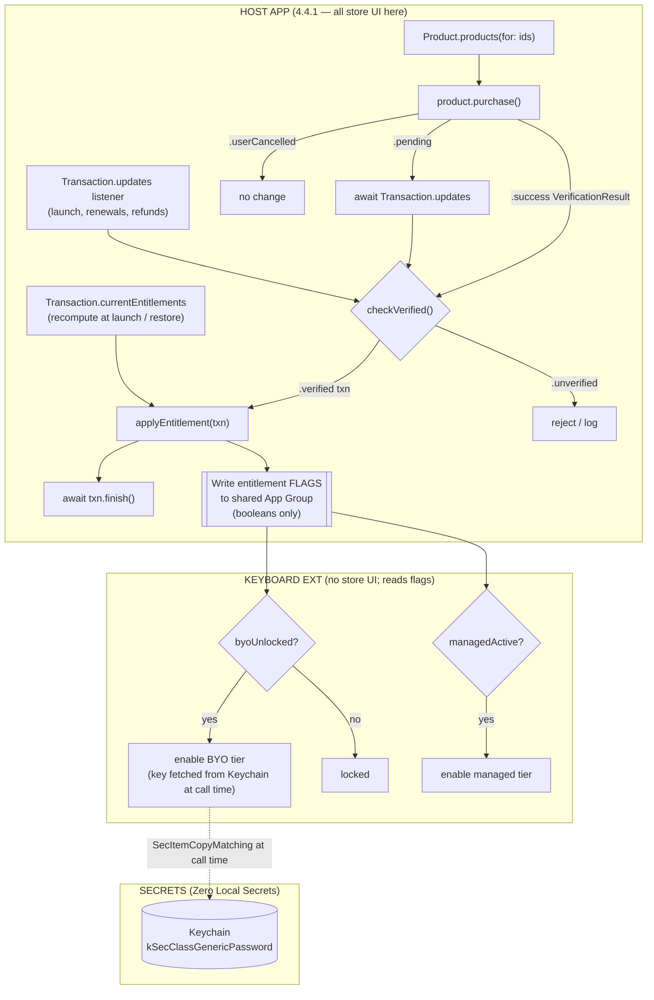

# StoreKit 2 + AutoFill Credential Provider + Keychain — Developer Reference

**hydratype** · Epics **E8** (monetization) + **E12** (AutoFill credential provider, re-scoped) · Hardening **H2** (secure fields), **Zero Local Secrets** axiom
**Dated:** 2026-07-19
**Target platform assumption:** iOS 17+ (StoreKit 2 requires iOS 15+; the unified AutoFill `ASCredentialRequest` methods and modern StoreKit surface assume 17+).

> **Source-fidelity note (LOUD):** The canonical URLs on `developer.apple.com/documentation/...` are client-side (JavaScript) rendered. Automated `WebFetch` against them returns only the page shell, **not** the API prose — so the exact declarations below were reconstructed from the `fedelm` research pass (which itself cites those same Apple pages plus WWDC sessions) and from framework header knowledge. **Every declaration marked ⚠️ UNVERIFIED-AGAINST-LIVE-DOC should be re-checked in Xcode Quick Help / the rendered Apple page before shipping.** They are believed correct but were not confirmed by fetching the live rendered doc in this pass.

---

## 1. StoreKit 2 — monetization (E8)

### 1.1 Two products

| Product | Type | Price | Grants | StoreKit product type |
|---|---|---|---|---|
| **Tip / BYO unlock** | Non-consumable | ≥ $1.00 (tip-jar; pick a tier ≥ Tier 1) | Permanently enables the **BYO (bring-your-own-endpoint) tier** | `.nonConsumable` |
| **Managed tier** | Auto-renewable subscription | $5.00 / month | The **managed** hosted tier while active | `.autoRenewable` |

Define both in **App Store Connect**, and mirror them in a **StoreKit Configuration file** (`Products.storekit`) for local + CI testing (see §1.7).

### 1.2 Load products — `Product.products(for:)`

⚠️ UNVERIFIED-AGAINST-LIVE-DOC
```swift
import StoreKit

// static func products(for identifiers: some Collection<String>) async throws -> [Product]
let ids: Set<String> = ["com.hydratype.byo.unlock", "com.hydratype.managed.monthly"]
let products = try await Product.products(for: ids)
```
`Product` exposes `id`, `displayName`, `description`, `displayPrice`, `price`, `type`, and `subscription` (a `Product.SubscriptionInfo?` for the auto-renewable).

### 1.3 Purchase — `product.purchase()`

⚠️ UNVERIFIED-AGAINST-LIVE-DOC
```swift
// func purchase(options: Set<Product.PurchaseOption> = []) async throws -> Product.PurchaseResult
switch try await product.purchase() {
case .success(let verification):
    let transaction = try checkVerified(verification)   // see §1.5
    await applyEntitlement(for: transaction)             // unlock feature
    await transaction.finish()                           // §1.6 — REQUIRED
case .userCancelled:
    break
case .pending:
    // Ask-to-Buy / SCA — resolution arrives later via Transaction.updates (§1.4)
    break
@unknown default:
    break
}
```
`PurchaseResult` cases: `.success(VerificationResult<Transaction>)`, `.userCancelled`, `.pending`.

### 1.4 Transaction listener — `Transaction.updates`

Start this **at app launch** (a detached `Task` that lives for the whole app), before any UI, so you catch renewals, Ask-to-Buy approvals, refunds, and cross-device purchases.

⚠️ UNVERIFIED-AGAINST-LIVE-DOC
```swift
// static var updates: Transaction.Transactions   (an AsyncSequence of VerificationResult<Transaction>)
@MainActor
final class Store: ObservableObject {
    private var updatesTask: Task<Void, Never>?

    func startListening() {
        updatesTask = Task.detached { [weak self] in
            for await result in Transaction.updates {
                guard let self, let txn = try? self.checkVerified(result) else { continue }
                await self.applyEntitlement(for: txn)
                await txn.finish()
            }
        }
    }

    deinit { updatesTask?.cancel() }
}
```

### 1.5 Verify — `VerificationResult`

StoreKit 2 signs every transaction (JWS). **Never trust an `.unverified` payload.**

⚠️ UNVERIFIED-AGAINST-LIVE-DOC
```swift
// enum VerificationResult<SignedType> { case verified(SignedType); case unverified(SignedType, VerificationResult.VerificationError) }
enum StoreError: Error { case failedVerification }

func checkVerified<T>(_ result: VerificationResult<T>) throws -> T {
    switch result {
    case .verified(let safe):            return safe
    case .unverified(_, let error):      throw StoreError.failedVerification  // log `error`
    }
}
```
Newer SDKs also expose `result.payloadValue` (returns the value or throws if unverified) as a shorthand.

### 1.6 Finish — `Transaction.finish()`

⚠️ UNVERIFIED-AGAINST-LIVE-DOC
```swift
// func finish() async
await transaction.finish()
```
Call **after** you have delivered/persisted the entitlement. Until finished, the transaction stays in the queue and StoreKit keeps re-delivering it via `Transaction.updates`. (Consumables must be finished after crediting; non-consumables and subscriptions after applying access.)

### 1.7 Current entitlements — `Transaction.currentEntitlements`

The source of truth for "what does this user own right now" — iterate at launch and after any purchase/update to recompute unlocked state.

⚠️ UNVERIFIED-AGAINST-LIVE-DOC
```swift
// static var currentEntitlements: Transaction.Transactions   (AsyncSequence of VerificationResult<Transaction>)
func refreshEntitlements() async {
    var byoUnlocked = false
    var managedActive = false
    for await result in Transaction.currentEntitlements {
        guard let txn = try? checkVerified(result) else { continue }
        switch txn.productID {
        case "com.hydratype.byo.unlock":       byoUnlocked = true
        case "com.hydratype.managed.monthly":  managedActive = (txn.revocationDate == nil)
        default: break
        }
    }
    // persist ONLY booleans/flags — never secrets — to the shared App Group (§4.3)
}
```
> **Deprecation note (per fedelm / Apple):** the older singular `Transaction.currentEntitlement(for:)` is superseded — as of iOS 18.4 use `Transaction.currentEntitlements(for: productID)` for a single-product query. Do **not** hardcode the deprecated singular form. ⚠️ Re-verify the exact 18.4 signature in the live doc.

### 1.8 StoreKit config file for testing

- Add a **StoreKit Configuration file** (`.storekit`) to the project; define both products with matching IDs/prices.
- Select it under **Scheme ▸ Run ▸ Options ▸ StoreKit Configuration** to test purchases/renewals/refunds in the simulator with no App Store Connect round-trip.
- Use `SKTestSession` (StoreKitTest framework) for automated/CI tests (buy, refund, expire, clear transactions).

---

## 2. The 4.4.1 constraint (E8 architecture rule)

**App Store Review Guideline 4.4.1 (Keyboard extensions):** keyboard extensions **must not** include in-app purchase, marketing, or advertising UI, must function without full network access, and must not launch other apps (except Settings).

**Consequence for hydratype (hard rule):**
- **All monetization UI — paywall, product list, purchase buttons, "restore purchases", manage-subscription link — lives in the HOST APP, never in the keyboard extension.**
- The keyboard extension only **reads** the resulting entitlement flags (booleans) from the **shared App Group** (see §4.3) to gate features. It performs **no** `product.purchase()` calls and shows no store UI.
- Restore = re-iterate `Transaction.currentEntitlements` in the host app; write the recomputed flags to the App Group.

---

## 3. AutoFill Credential Provider extension (E12, re-scoped)

### 3.1 What it is / how it differs from the keyboard

An **AutoFill Credential Provider extension** subclasses **`ASCredentialProviderViewController`** (framework: **AuthenticationServices**). It runs in its **own sandboxed process**, separate from any keyboard, and is invoked only by the **system AutoFill UI** — the QuickType bar / "Passwords" affordance above the keyboard. It is **not** a text-input mechanism: it never sees or types into arbitrary fields. It supplies a selected credential (password or passkey) that **iOS** inserts into the login/password fields.

| | Custom keyboard extension | AutoFill Credential Provider |
|---|---|---|
| Purpose | Replace system keyboard for all text input | Supply credentials into login/password fields |
| Sees secure fields? | **No** — iOS swaps to the system keyboard for `isSecureTextEntry` | Only provides via system AutoFill; iOS controls insertion |
| Process | Keyboard process | Separate sandboxed process |
| Network | Needs user-granted **Full Access** | May use network; credential metadata stored locally |
| Base class | `UIInputViewController` | `ASCredentialProviderViewController` |

**Works WITH a password manager as the provider:** the credential provider extension is how a third-party manager (e.g. **Bitwarden**, 1Password, iCloud Keychain) offers credentials system-wide. hydratype's re-scoped E12 delivery is **this extension type** — it cooperates with the user's chosen password provider rather than trying to handle passwords inside the keyboard.

### 3.2 Hardening H2 — iOS, not the keyboard, handles secure fields

When a field is `UITextField.isSecureTextEntry = true` (or SwiftUI `SecureField`), **iOS automatically deactivates any third-party/custom keyboard and shows the system keyboard.** This is system-enforced and cannot be bypassed. Certain keyboard types (`.phonePad`, `.namePhonePad`) also force the system keyboard. Therefore:
- hydratype's **keyboard never receives password keystrokes** — the OS guarantees it.
- Credential entry is routed through the **AutoFill** path (§3.1), where iOS mediates insertion.
- Apps can additionally disallow all third-party keyboards via `application(_:shouldAllowExtensionPointIdentifier:)` returning `false` for `.keyboard`.

### 3.3 Key methods & lifecycle

⚠️ UNVERIFIED-AGAINST-LIVE-DOC — signatures reconstructed from headers + fedelm; confirm in Xcode Quick Help.

```swift
import AuthenticationServices

class CredentialProviderViewController: ASCredentialProviderViewController {

    // 1. User taps the AutoFill entry — show a pick list of matching credentials.
    override func prepareCredentialList(for serviceIdentifiers: [ASCredentialServiceIdentifier]) { }

    // 2. Fast/silent path — provide without UI if possible (iOS 17+ unified request type).
    override func provideCredentialWithoutUserInteraction(for credentialRequest: ASCredentialRequest) {
        // If unlock/auth is needed:
        // extensionContext.cancelRequest(withError:
        //   NSError(domain: ASExtensionErrorDomain,
        //           code: ASExtensionError.userInteractionRequired.rawValue))
    }

    // 3. Interactive path after userInteractionRequired — present auth UI, then complete.
    override func prepareInterfaceToProvideCredential(for credentialRequest: ASCredentialRequest) { }

    // 4. Optional — shown when the user enables the extension in Settings
    //    (requires ASCredentialProviderExtensionShowsConfigurationUI = YES in Info.plist).
    override func prepareInterfaceForExtensionConfiguration() { }
}
```
Finish a request via the extension context (type **`ASCredentialProviderExtensionContext`**):
```swift
extensionContext.completeRequest(withSelectedCredential: ASPasswordCredential(user: u, password: p),
                                 completionHandler: nil)
// or
extensionContext.cancelRequest(withError: error)
```
> **iOS 17+ unification (LOUD):** the older iOS 12–16 methods took `ASPasswordCredentialIdentity`; iOS 17 introduced **unified `ASCredentialRequest`** overloads that also cover **passkeys** (`ASPasskeyCredentialRequest`) plus passkey-registration methods (`prepareInterface(forPasskeyRegistration:)`, `completeRegistrationRequest(...)`). Confirm exactly which overloads your deployment target exposes.

---

## 4. Keychain — BYO endpoint keys (Zero Local Secrets axiom)

### 4.1 The axiom

BYO endpoint API keys are **secrets**. They are **never** written to the app database, `UserDefaults`, plist, or any on-disk file. They live **only** in the **Keychain** (`kSecClassGenericPassword`) and are **fetched at call time only**, held in memory transiently, then dropped.

### 4.2 Store / read / delete — `SecItem*`

The Keychain API is the Core Foundation C surface (framework: **Security**). All return `OSStatus` (`errSecSuccess == 0`).

```swift
import Security

// STORE (upsert): delete-then-add avoids errSecDuplicateItem
func saveKey(_ value: String, account: String, service: String = "com.hydratype.byo") throws {
    let data = Data(value.utf8)
    let base: [String: Any] = [
        kSecClass as String:       kSecClassGenericPassword,
        kSecAttrService as String: service,
        kSecAttrAccount as String: account,
    ]
    SecItemDelete(base as CFDictionary)                    // OSStatus (ignore errSecItemNotFound)
    var add = base
    add[kSecValueData as String] = data
    add[kSecAttrAccessible as String] = kSecAttrAccessibleAfterFirstUnlockThisDeviceOnly
    let status = SecItemAdd(add as CFDictionary, nil)      // OSStatus
    guard status == errSecSuccess else { throw KeychainError.status(status) }
}

// READ (at call time only)
func readKey(account: String, service: String = "com.hydratype.byo") throws -> String {
    let query: [String: Any] = [
        kSecClass as String:       kSecClassGenericPassword,
        kSecAttrService as String: service,
        kSecAttrAccount as String: account,
        kSecReturnData as String:  true,
        kSecMatchLimit as String:  kSecMatchLimitOne,
    ]
    var out: AnyObject?
    let status = SecItemCopyMatching(query as CFDictionary, &out)   // OSStatus
    guard status == errSecSuccess, let d = out as? Data, let s = String(data: d, encoding: .utf8)
    else { throw KeychainError.status(status) }
    return s   // use immediately for the request; do not persist or cache to disk
}

// DELETE
func deleteKey(account: String, service: String = "com.hydratype.byo") {
    SecItemDelete([
        kSecClass as String:       kSecClassGenericPassword,
        kSecAttrService as String: service,
        kSecAttrAccount as String: account,
    ] as CFDictionary)
}

enum KeychainError: Error { case status(OSStatus) }
```

### 4.3 Sharing across app + extensions

- Entitlement flags (from §1.7) → **App Group** shared container (booleans only; safe to share).
- If the BYO key must be reachable from an extension, use a **Keychain access group** (`kSecAttrAccessGroup`, shared via the Keychain Sharing capability) — still never on disk. Prefer `...ThisDeviceOnly` accessibility so keys don't sync/backup off-device.
- **Never** put a secret in the App Group container (it's a plain file/prefs store, not the Keychain).

---

## 5. Purchase → entitlement → feature-unlock flow



---

## 6. Tier → entitlement mapping

| Tier / feature | Unlocked by | Product ID (example) | Entitlement check | Where enforced |
|---|---|---|---|---|
| **Free** | default | — | none | keyboard + host |
| **BYO tier** (bring-your-own endpoint) | Non-consumable tip-unlock (≥ $1) | `com.hydratype.byo.unlock` | `currentEntitlements` contains the product (no `revocationDate`) | Host writes flag → keyboard reads; key from Keychain at call time |
| **Managed tier** ($5/mo hosted) | Auto-renewable subscription | `com.hydratype.managed.monthly` | `currentEntitlements` contains it **and** `revocationDate == nil` (active) | Host writes flag → keyboard reads |

---

## 7. Checklist

- [ ] `Transaction.updates` listener started at app launch, before UI.
- [ ] Every purchase path verifies via `VerificationResult` and `finish()`es after delivery.
- [ ] Entitlements recomputed from `Transaction.currentEntitlements` at launch + on "Restore".
- [ ] **Zero store UI in the keyboard extension** (4.4.1).
- [ ] E12 delivered as `ASCredentialProviderViewController` extension, cooperating with the user's password manager — not password handling inside the keyboard.
- [ ] Secure fields left to iOS (H2); keyboard never receives password keystrokes.
- [ ] BYO keys only in Keychain (`kSecClassGenericPassword`, `...ThisDeviceOnly`), fetched at call time, never on disk / in DB / in App Group.
- [ ] `.storekit` config file wired into the scheme for local + CI testing.
- [ ] ⚠️ Re-verify every ⚠️-marked signature in Xcode Quick Help / rendered Apple docs before shipping.

---

## Sources

Official Apple (canonical — see source-fidelity note; JS-rendered, not machine-fetchable in this pass):
- StoreKit — https://developer.apple.com/documentation/storekit
- `Transaction.currentEntitlements` — https://developer.apple.com/documentation/storekit/transaction/currententitlements
- AuthenticationServices / `ASCredentialProviderViewController` — https://developer.apple.com/documentation/authenticationservices/ascredentialproviderviewcontroller
- Keychain Services — https://developer.apple.com/documentation/security/keychain-services
- App Store Review Guidelines (incl. 4.4.1) — https://developer.apple.com/app-store/review/guidelines/
- WWDC25 session 241 (StoreKit) — https://developer.apple.com/videos/play/wwdc2025/241/
- WWDC18 session 721 (Implementing AutoFill Credential Provider Extensions) — https://developer.apple.com/videos/play/wwdc2018/721/
- Apple Platform Security — Credential provider extensions — https://support.apple.com/guide/security/credential-provider-extensions-sec6319ac7b9/web
- Apple Platform Security — Supporting extensions (keyboard/secure fields) — https://support.apple.com/guide/security/supporting-extensions-secabd3504cd/web
- Custom Keyboard (App Extension Programming Guide, archive) — https://developer.apple.com/library/archive/documentation/General/Conceptual/ExtensibilityPG/CustomKeyboard.html

Supporting / corroborating (secondary):
- Mastering StoreKit 2 — https://swiftwithmajid.com/2023/08/01/mastering-storekit2/
- iOS AutoFill deep dive — https://zenn.dev/kakuremi/articles/kakuremi-ios-autofill-deep-dive?locale=en
- 4.4.1 rejection notes — https://appstorereject.com/rejections/apple/4/guideline-441-design-keyboard-extension-requiring-full-access-without-justification

_Compiled via `fedelm` research (Perplexity Search API + DeepSeek) 2026-07-19. Live Apple doc pages could not be machine-fetched (client-rendered); ⚠️-marked API signatures must be confirmed in Xcode before shipping._
